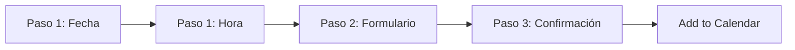

# 📅 Booking Module

Sistema de agendamiento premium de 3 pasos con integración simulada para Cal.com.

## 🏗️ Arquitectura

### Componentes Principales

```
src/components/booking/
├── BookingWidget.astro       # Orquestador principal del flujo
├── Calendar.astro             # Selector de fecha
├── TimeSlots.astro            # Selector de hora (12h/24h)
├── UserForm.astro             # Formulario de datos del usuario
├── SuccessSection.astro       # Confirmación y "Add to Calendar"
├── booking.store.ts           # Estado global (nanostores)
├── booking.types.ts           # Definiciones TypeScript
└── booking.service.mock.ts    # Servicio simulado (reemplazar con Cal.com)
```

### Flujo de Usuario



## 🎨 Características

- ✅ **3 Pasos Fluidos**: Transiciones cinematográficas con altura dinámica
- ✅ **Tema Dual**: Soporte completo para Light/Dark mode
- ✅ **Formato de Hora**: Toggle 12h/24h en tiempo real
- ✅ **Mock Backend**: Sistema simulado configurable para pruebas
- ✅ **Add to Calendar**: Google, Outlook, iCal
- ✅ **Responsive**: Optimizado para mobile, tablet y desktop

## 🚀 Uso

### Integrar en una Página

```astro
---
import BookingWidget from '@/components/booking/BookingWidget.astro';
---

<BookingWidget />
```

### Configurar Mock Service

Edita `booking.service.mock.ts`:

```typescript
export const MOCK_CONFIG = {
    eventDurationMinutes: 45,
    workingHours: { start: 9, end: 18 },
    daysOfWeekAvailable: [1, 2, 3, 4, 5], // Lun-Vie
    simulationLatencyMs: 800,
    forceFailureRate: 0.1, // 10% de error simulado
};
```

## 🔧 Estado Global

El módulo usa `nanostores` para gestionar el estado:

```typescript
import { bookingStore, setStep, setTimeFormat } from './booking.store';

// Leer estado
bookingStore.subscribe((state) => {
    console.log(state.step, state.selectedDate);
});

// Actualizar
setStep(2);
setTimeFormat('12h');
```

## 📝 Tipos de Reunión

- **Google Meet**: Genera enlace automático
- **Zoom**: Genera enlace automático
- **Microsoft Teams**: Genera enlace automático
- **Teléfono**: Llamada al número proporcionado
- **Presencial**: Reunión en oficinas

## 🎯 Próximos Pasos

Ver [`NEXT_STEPS.md`](./NEXT_STEPS.md) para el roadmap de integración con Cal.com.

## 🐛 Debugging

### Forzar Errores de Conexión

```typescript
// En booking.service.mock.ts
forceFailureRate: 1, // 100% de error
```

### Ver Estado en Consola

```javascript
// En DevTools Console
bookingStore.get();
```

## 📦 Dependencias

- `nanostores`: Estado reactivo
- `astro-icon`: Iconografía
- `date-fns` (opcional): Para formateo avanzado de fechas

---

**Última actualización**: Febrero 2026  
**Estado**: ✅ Mock completo | ⏳ Integración Cal.com pendiente
